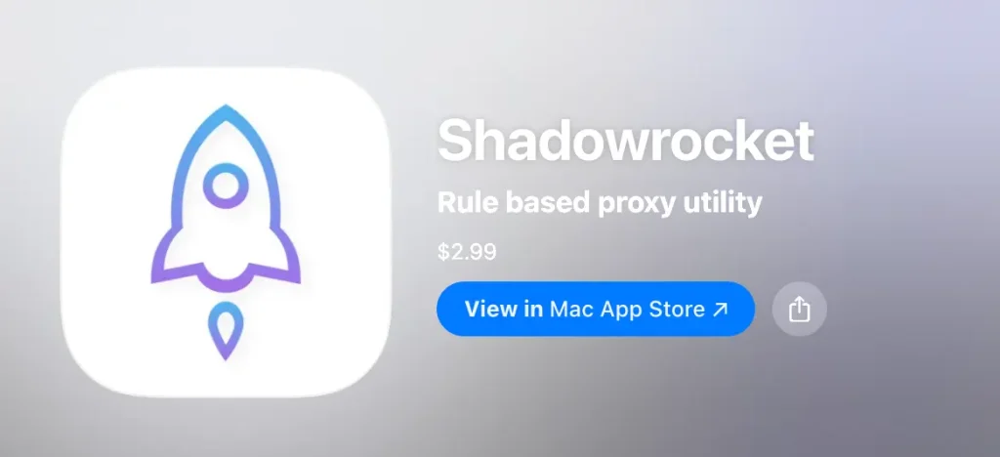
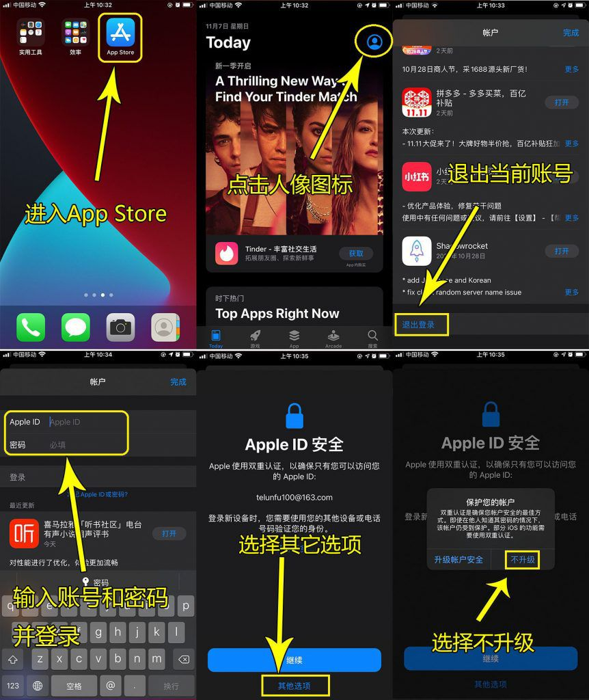

## 下载安装 – shadowrocket

## Shadowrocket下载（2026最新）iOS安装教程 + 官方App Store下载地址

Shadowrocket下载是当前iOS用户获取小火箭的主要方式。由于Shadowrocket未在中国区App Store上架， 很多用户在搜索Shadowrocket下载时会遇到无法下载或无法搜索到的问题。 本文提供2026最新Shadowrocket下载方法，包含官方App Store下载入口、iOS安装步骤及常见问题解决方案。

🔔提示：Shadowrocket下载与安装仅支持通过官方App Store完成，目前不存在网页一键安装或第三方安装包方式。
如果您在搜索“Shadowrocket IPA安装”或“免ID下载”，请注意识别风险。本文提供官方安全下载入口及完整安装教程。

### 支持设备及系统要求（2026最新）

Shadowrocket 官方兼容以下系统：

- **iPhone / iPad / iPod touch**：iOS 13.0 或更高版本
- **Mac**：macOS 10.15 或更高版本
- **Apple TV**：tvOS 17.0 或更高版本
- **Apple Vision Pro**：visionOS 1.0 或更高版本

如果你使用的是最新 iOS 26 / macOS Sequoia 等系统，均可正常安装并运行。

### 为什么您需要这份安装指南？

由于 App Store 的区域政策限制，很多新用户在搜索 **Shadowrocket**（俗称“小火箭”）时会遇到无法搜到、或者误下载到山寨版本的问题。官方正版 Shadowrocket 开发者为 Li Guangming，图标为一个白色背景的小火箭。如下图所示：

### Shadowrocket 在线安装详细步骤（iOS / iPadOS）

由于 iOS 系统安全限制，目前所有正版小火箭均需通过 App Store 完成安装，请勿相信任何“网页一键安装包”，以免造成设备ID退不出或是锁机的情况。

#### 步骤一：准备非大陆区的Apple ID

Shadowrocket 目前未在中国区 App Store 上架。您需要准备一个 **美区（US）或港区（HK）**的 Apple ID 才能进行下载。（由于这个是付费App，准备的ID必须已经购买了这个软件，才可以下载）

#### 步骤二：切换 App Store 账号。

1. 打开您的 **App Store**。
2. 点击右上角头像，拉到最底部点击 **“退出登录” (Sign Out)**。
3. 向上滑动，输入您的美区或港区 Apple ID 和密码。
4. 登录成功后，App Store 会自动切换至对应区域。

#### 步骤三：搜索与下载

在搜索框输入 `Shadowrocket`，认准图标/开发者并进行下载。

**Shadowrocket 官方下载入口**：https://apps.apple.com/us/app/shadowrocket/id932747118

🔔提示：如果暂时没有海外Apple ID，可以参考此教程[自行注册](https://clashgithub.com/usa-apple-id.html)， 也可以通过正规渠道获取已购买Shadowrocket的账号用于下载（仅作为辅助方式）。

👉 Shadowrocket免费账号获取入口：[点击前往](https://idshare001.me/goso.html)    **如因自己操作不当，导致的任何损失，由用户自行承担。 **

### Shadowrocket 各地区官方价格参考

| App Store 区域 | 官方价格          | 下载建议                             |
| -------------- | ----------------- | ------------------------------------ |
| 美国（US）     | $2.99             | **最推荐**，App 数量最全，兼容性最好 |
| 香港（HK）     | HK$22             | 需要有香港的信用卡或香港支付宝等方式 |
| 台湾（TW）     | $90.00            | 需绑定台湾信用卡/支付方式            |
| 其他区域       | 约 $2.99 相当金额 | 根据您持有的支付方式选择             |

### 常见问题与安装报错解决（FAQ）

**Q1：为什么在App Store搜索不到 Shadowrocket ？**

A：Shadowrocket未在中国区App Store上架，需要在App Store登录非大陆ID，商店内容切换到非大陆的应用内容，重新搜索即可搜索到！

**Q2：为什么我搜到了 Shadowrocket 但需要付费？**

A：Shadowrocket 是一款买断制付费软件（2.99美金），所有宣称免费下载的链接通常带有广告或风险。建议购买兑换码直接绑定在自己的 ID 上，享受永久更新。

**Q3：Shadowrocket无法下载 / 获取按钮灰色怎么办？？**

 A：可能是因为Apple ID 地区不正确，或是没有绑定支付方式（部分地区限制）。您可以更换美国Apple ID，或使用已经购买过 Shadowrocket 的账号下载。

**Q4：Mac 系统如何安装 Shadowrocket？**

 A：Mac 可以直接在 App Store 搜索并安装 App，即使是intel 芯片也支持安装。

**Q5：Shadowrocket下载后无法使用 / 无法连接怎么办？**

A：首先请确保您的订阅链接（节点）有效。其次，检查小火箭底部的“全局路由”是否设置为“配置”模式。如果是初次使用，系统会弹出“添加VPN配置”的请求，请务必点击“允许”并输入手机锁屏密码。

**Q6：Shadowrocket安装提示“无法验证应用”怎么办？**

A：请确认Apple ID已正常登录，并尝试切换网络后重新打开App Store下载安装。

**Q7：Shadowrocket支持哪些设备？**

支持iPhone、iPad、Mac以及Apple TV等设备，需对应系统版本支持。具体可以参考文章开始部分：支持设备与系统要求！