## 最新 Shadowrocket 使用教程快速入门篇

Shadowrocket又名小火箭是iOS系统即苹果手机系统下的代理软件客户端，同样也适用于苹果平板电脑，功能强大且支持多种代理协议，如SS、SSR、V2Ray、Xray、Trojan等代理协议。通过本文2023最新Shadowrocket使用教程快速入门篇所掌握的技巧，能快速方便配置代理协议进行代理访问。

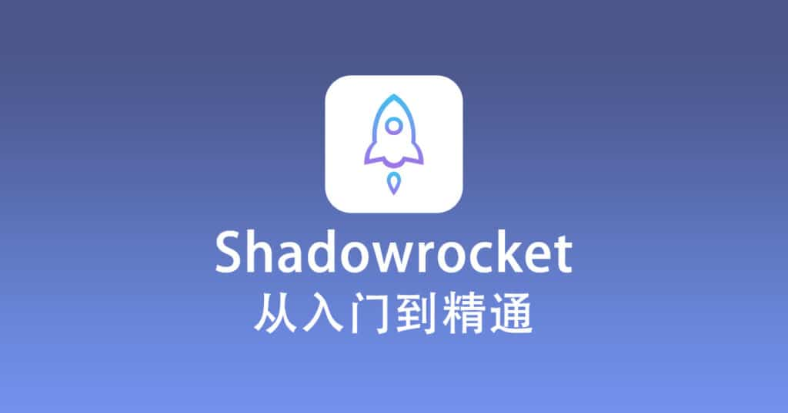

### 界面预览

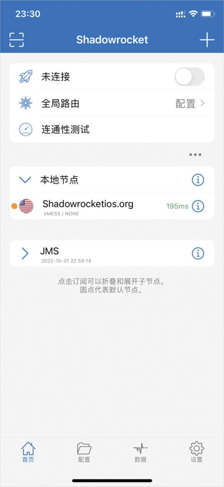

### 下载

#### 官网下载

**Shadowrocket官网**下载地址：https://apps.apple.com/us/app/shadowrocket/id932747118 ，也可使用非大陆区苹果Apple Store直接下载，推荐使用美区Apple ID登录后在美区Apple Store下载，自己动手注册即可，无须购买，详见[免费美区 Apple ID 申请注册教程](https://clashgithub.com/usa-apple-id.html)。

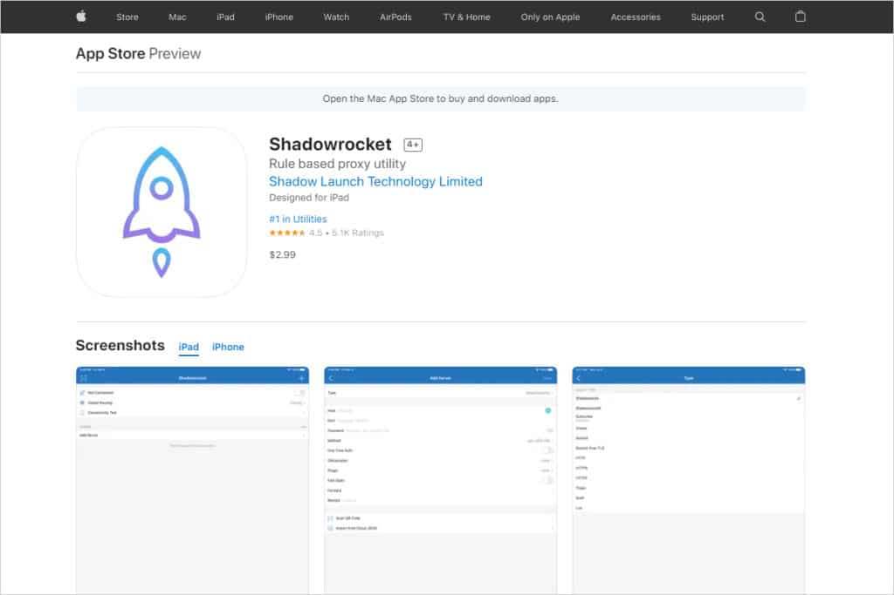

#### 购买价格

| 区域           | 价格      | 直达                                                         |
| -------------- | --------- | ------------------------------------------------------------ |
| 美区 App Store | USD 2.99  | [美区 App Store 下载 Shadowrocket](https://apps.apple.com/us/app/shadowrocket/id932747118) |
| 港区 App Store | HKD 23.00 | [港区 App Store 下载 Shadowrocket](https://apps.apple.com/hk/app/shadowrocket/id932747118) |

不同区域应用商店购买价格

#### 免费共享账号

👉 Shadowrocket免费账号获取入口：[点击前往](https://idshare001.me/goso.html)    **如因自己操作不当，导致的任何损失，由用户自行承担。 **

### 安装教程

直接使用外区 Apple ID 登录 App Store 后，使用搜索功能找到软件直接购买下载安装即可，如下图所示。

 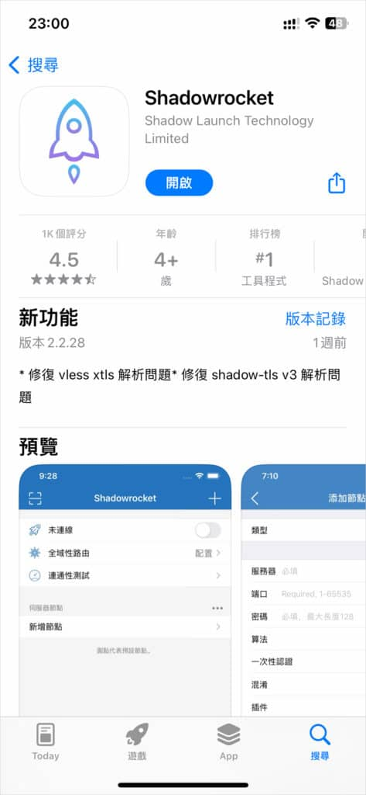

### 节点服务器

节点即软件中的**服务器**，在使用之前，首先需要添加一个 **Shadowrocket节点** 即服务端才能使用代理上网功能。

#### 免费节点

由于软件支持Shadowsocks(SS)、ShadowsocksR(SSR)、VMess(V2Ray)、VLESS(Xray)、Trojan等代理协议，如需[**免费节点**](https://clashgithub.com/)可以使用搜索引擎搜索。

#### 收费节点

免费节点资源少或者觉得免费节点不稳定的话可以考虑购买收费节点。

技术小白建议购买机场，无需编写配置文件，直接导入节点订阅地址链接即可使用。

机场推荐购买：

- 【 [ORYMI（点击注册）](https://orymi.net/#/register?code=rDsEp8Hf)】  免费观看netflix、disney+、primevideo、hbomax   九折优惠码：LxwSsaay
- 【 [星辰加速（点击注册）](https://starlinkboost.com/#/register?code=9kfk8enH)】  150G/9元/月  免账号观看disney+   九折优惠码：3UJuVnq

注：跳转链接可能会 **被墙** ，如多次打开失败，请使用代理打开

### 添加节点

#### 扫描二维码添加节点

首先从电脑打开服务器节点的二维码图片或者把二维码图片保存至手机，然后点击软件主界面左上角的扫描按钮即可出现添加配置文件选项，选择扫描二维码，扫描电脑屏幕上的二维码或选择从手机相册打开二维码图片扫描配置文件二维码即可导入节点信息。

#### 添加 Shadowsocks 节点

支持添加 Shadowsocks 节点，点击软件主界面左上角 ➕ 按钮，在弹出窗口进入添加节点界面，类型选择 `Shadowsocks` 后，出现 Shadowsocks 配置界面。

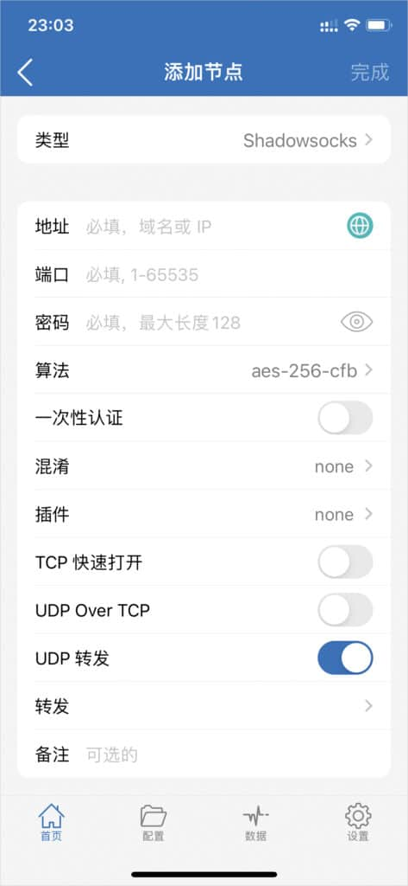

#### 添加 ShadowsocksR 节点

支持添加 ShadowsocksR 节点，点击软件主界面左上角 ➕ 按钮，在弹出窗口进入添加节点界面，类型选择 `ShadowsocksR` 后，出现 ShadowsocksR 配置界面。

#### 订阅地址添加节点

通过订阅 URL 地址或者 Clash YAML URL 添加节点。

软件支持直接使用机场订阅链接来添加节点信息，如下图所示点击软件主界面左上角 ➕ 按钮，在弹出窗口进入添加节点界面，类型选择 `Subscrube` 后，出现节点订阅配置界面，在 `URL` 处输入订阅地址，备注可选自己能记住识别的内容，其余选项按照默认即可，如下图所示。

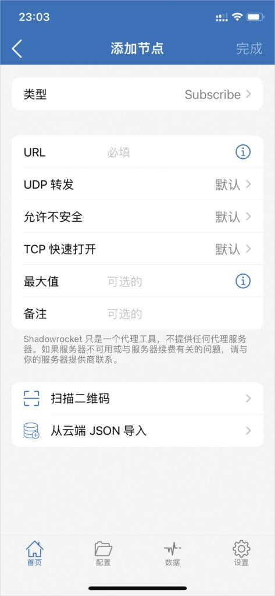

##### 自动更新订阅

点击软件主界面右下角设置 -> 订阅设置，如下图所示。

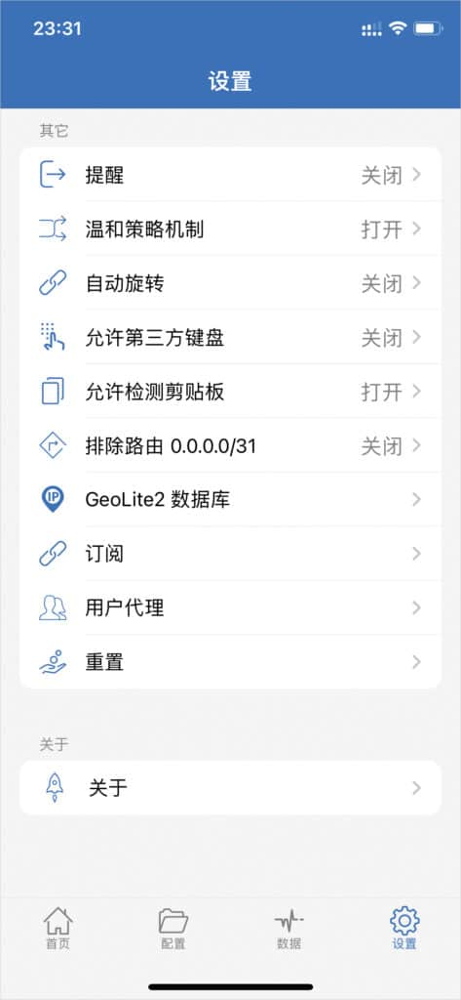设置 -> 订阅

进入订阅设置界面，使打开时更新按钮为选中状态，同时也可以设置自动后台更新，如下图所示。

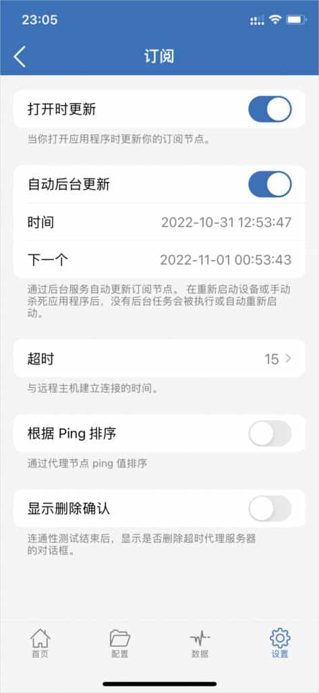自动更新订阅设置

#### 添加 Vmess 节点

协议类型为 V2ray Vess 的 V2Ray 服务器。支持添加 Vmess 节点，点击软件主界面左上角 ➕ 按钮，在弹出窗口进入添加节点界面，类型选择 `Vmess` 后，出现 Vmess 配置界面。

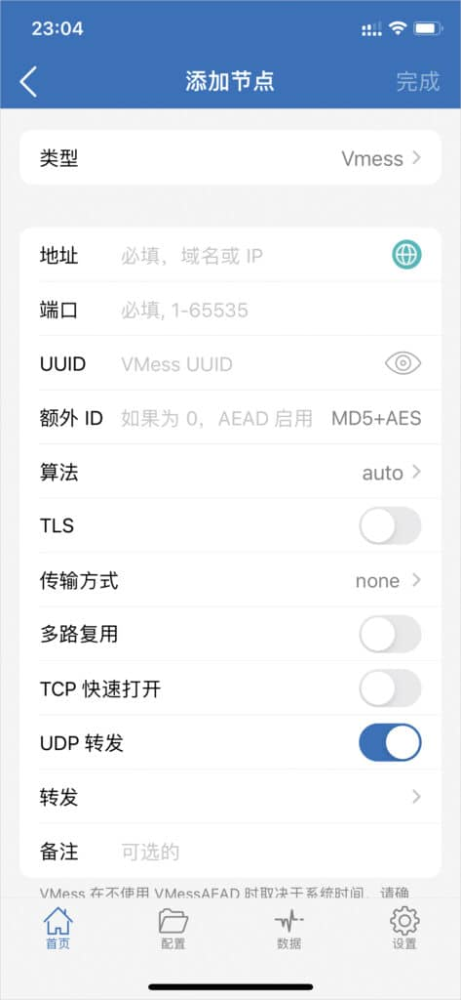添加 Vmess 节点

#### 添加 VLESS 节点

协议类型为 V2ray (4.27.0+) VLESS 的 Xray 服务器。支持添加 VLESS 节点，点击软件主界面左上角 ➕ 按钮，在弹出窗口进入添加节点界面，类型选择 `VLESS` 后，出现 VLESS 配置界面。

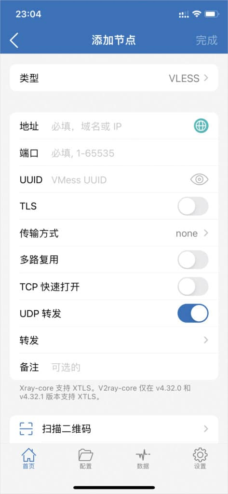添加 VLESS 节点

#### 添加 Relay 节点

协议类型为 GOST (2.11+) Relay 的服务器。支持添加 Relay 节点，点击软件主界面左上角 ➕ 按钮，在弹出窗口进入添加节点界面，类型选择 `Relay` 后，出现 Relay 配置界面。

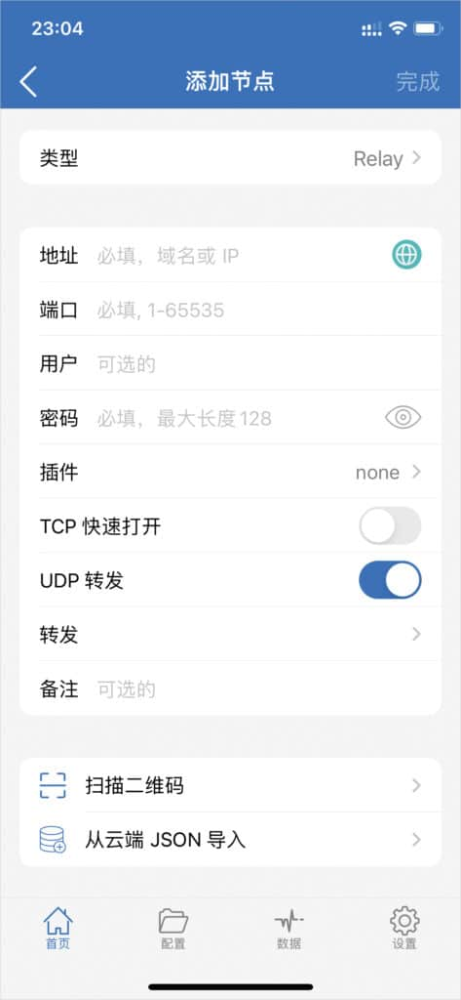添加 Relay 节点

#### 添加 Socks5 节点

支持添加 Socks5 节点，点击软件主界面左上角 ➕ 按钮，在弹出窗口进入添加节点界面，类型选择 `Socks5` 后，出现 Socks5 配置界面。

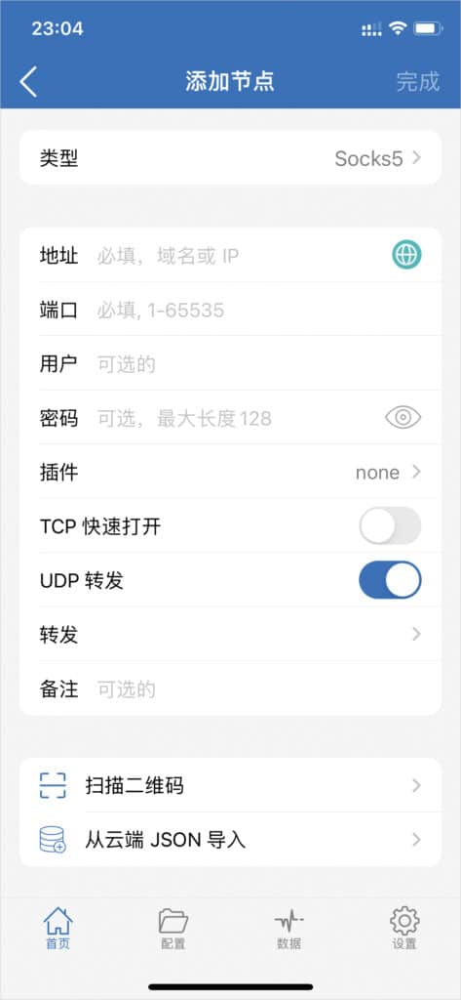添加 Socks5 节点

#### 添加 Socks5 Over TLS 节点

支持添加 Socks5 Over TLS 节点，点击软件主界面左上角 ➕ 按钮，在弹出窗口进入添加节点界面，类型选择 `Socks5 Over TLS` 后，出现 Socks5 Over TLS 配置界面。

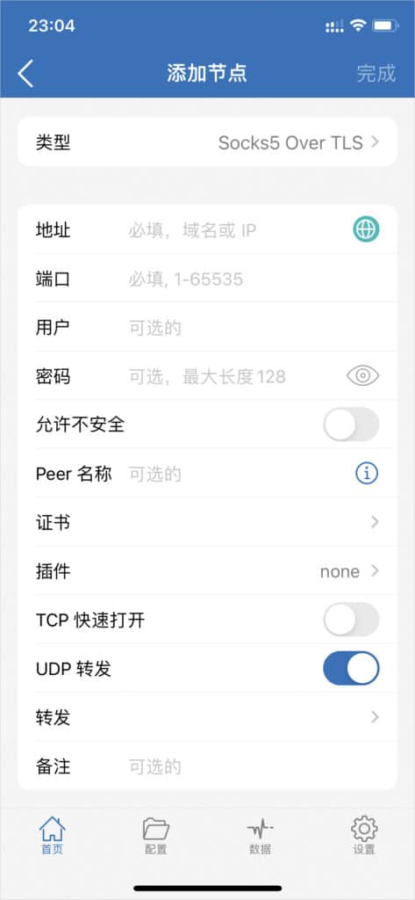添加 Socks5 Over TLS 节点

#### 添加 HTTP 节点

支持添加 HTTP 节点，点击软件主界面左上角 ➕ 按钮，在弹出窗口进入添加节点界面，类型选择 `HTTP` 后，出现 HTTP 配置界面。

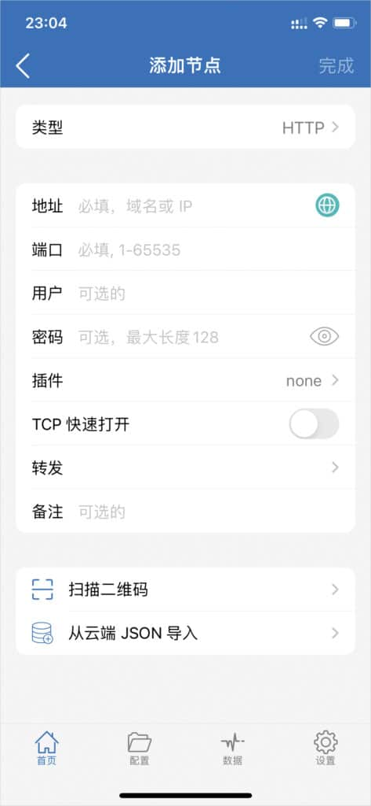添加 HTTP 节点

#### 添加 HTTPS 节点

协议类型为 HTTPS，NaiveProxy 的服务器。支持添加 HTTPS 节点，点击软件主界面左上角 ➕ 按钮，在弹出窗口进入添加节点界面，类型选择 `HTTPS` 后，出现 HTTPS 配置界面。

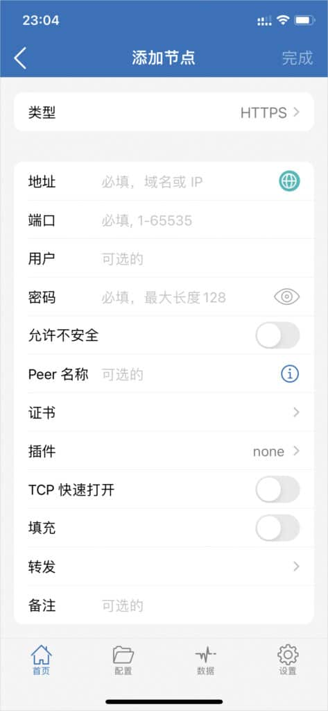添加 HTTPS 节点

#### 添加 HTTP2 节点

协议类型为 HTTP2，NaiveProxy 的服务器。支持添加 HTTP2 节点，点击软件主界面左上角 ➕ 按钮，在弹出窗口进入添加节点界面，类型选择 `HTTP2` 后，出现 HTTP2 配置界面。

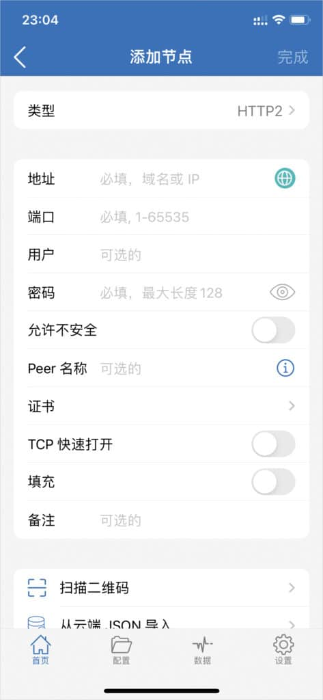添加 HTTP2 节点

#### 添加 Trojan 节点

协议类型为 Trojan, Tojan-Go 的服务器。支持添加 Trojan 节点，点击软件主界面左上角 ➕ 按钮，在弹出窗口进入添加节点界面，类型选择 `Trojan` 后，出现 Trojan 配置界面。

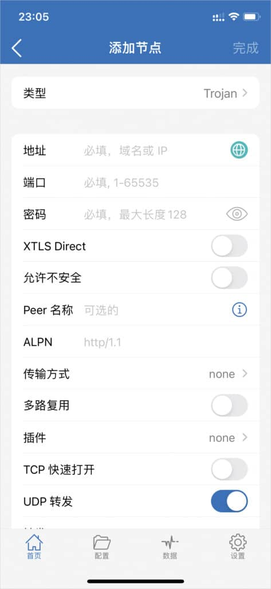添加 Trojan 节点

#### 添加 Hysteria 节点

支持添加 Hysteria 节点，点击软件主界面左上角 ➕ 按钮，在弹出窗口进入添加节点界面，类型选择 `Hysteria` 后，出现 Hysteria 配置界面。

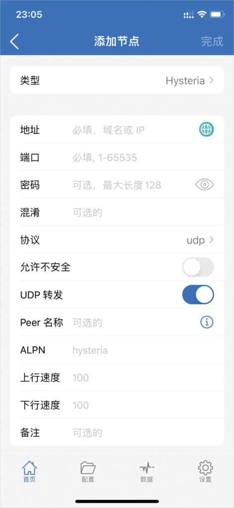添加 Hysteria 节点

#### 添加 TUIC 节点

支持添加 TUIC 节点，点击软件主界面左上角 ➕ 按钮，在弹出窗口进入添加节点界面，类型选择 `TUIC` 后，出现 TUIC 配置界面。

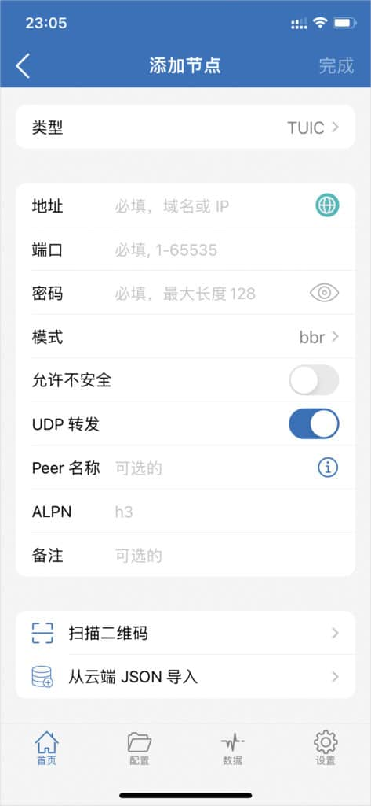添加 TUIC 节点

#### 添加 Snell 节点

支持添加 Snell 节点，点击软件主界面左上角 ➕ 按钮，在弹出窗口进入添加节点界面，类型选择 `Snell` 后，出现 Snell 配置界面。

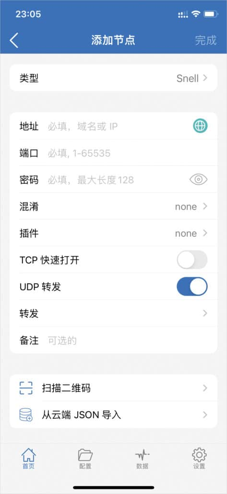添加 Snell 节点

#### 添加 Brook 节点

支持添加 Brook 节点，点击软件主界面左上角 ➕ 按钮，在弹出窗口进入添加节点界面，类型选择 `Brook` 后，出现 Brook 配置界面。

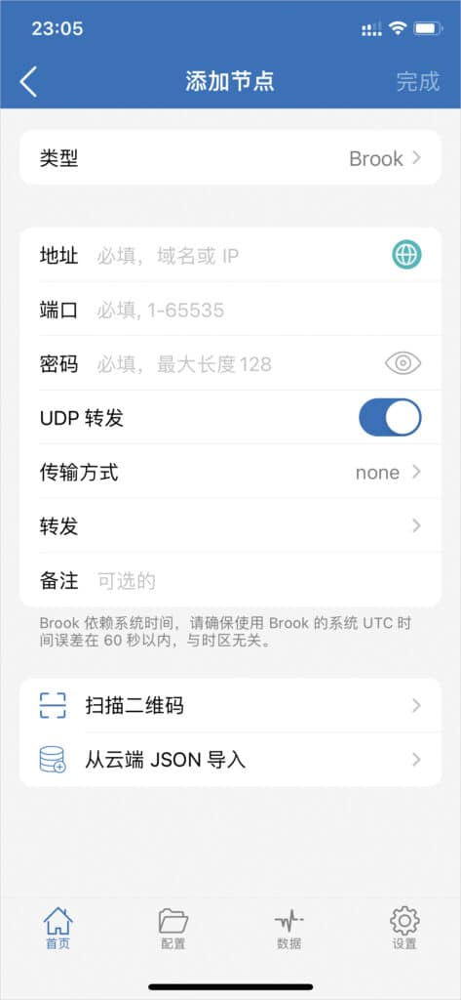添加 Brook 节点

#### 添加 Lua 节点

支持添加 Lua 节点，点击软件主界面左上角 ➕ 按钮，在弹出窗口进入添加节点界面，类型选择 `Lua` 后，出现 Lua 配置界面。

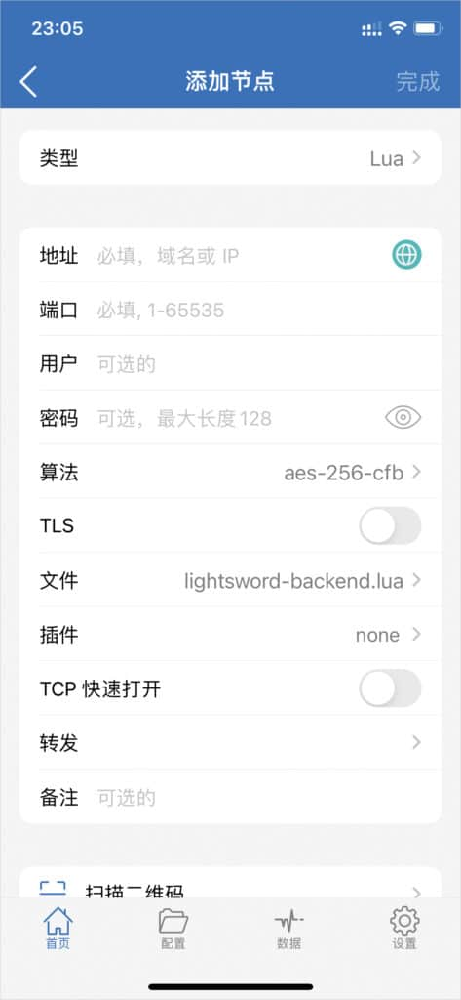添加 Lua 节点

### 使用教程

当添加完节点之后，就已经完成最基本的设置，已经可以开始使用代理了，在使用之前，先对服务器节点进行延迟测试。

#### 连通性测试

点击连通性测试，若干秒之后再节点右侧会有数值显示，如下图所示，数值越小代表速度越快。

连通性测试

#### 开启代理

在选择一个延迟较低的服务器节点后打开右上角的开关进行连接，如下图所示为开启状态。

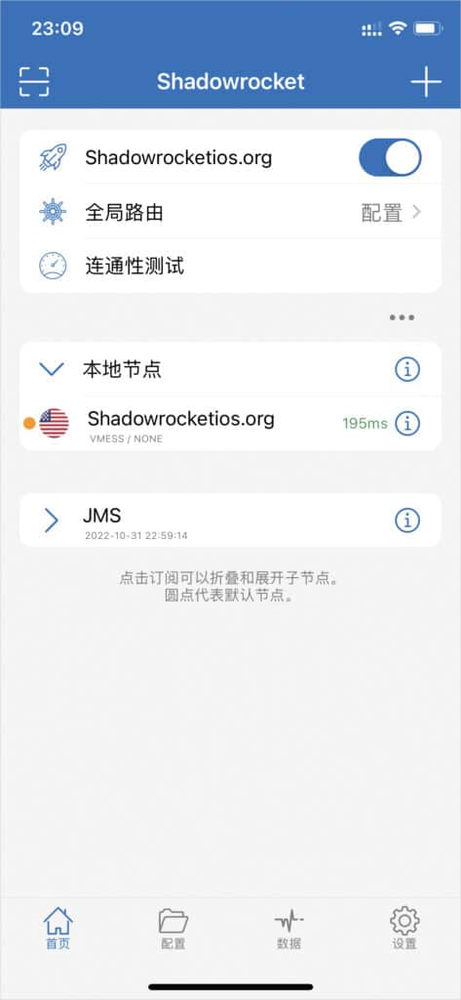开启代理

#### 全局路由

全局路由有以下四项可供选择，分别为配置路由模式、代理路由模式、直连路由模式、场景路由模式。

| 模式 | 说明                                                         |
| ---- | ------------------------------------------------------------ |
| 配置 | 根据配置软件自带的文件规则转发流量，也可以自定义规则，推荐使用此项。 |
| 代理 | 通过代理转发流量，即全部流量都走代理。                       |
| 直连 | 不使用代理转发流量，即全部流量都不走代理。                   |
| 场景 | 根据场景转发流量，此项不常用。                               |

全局路由各模式说明

全局路由选项建议设置为 配置 以实现自动分流功能，不影响国内服务的连接，如下图所示。

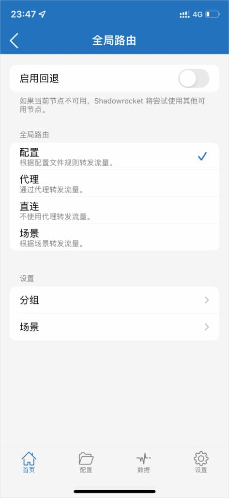全局路由

