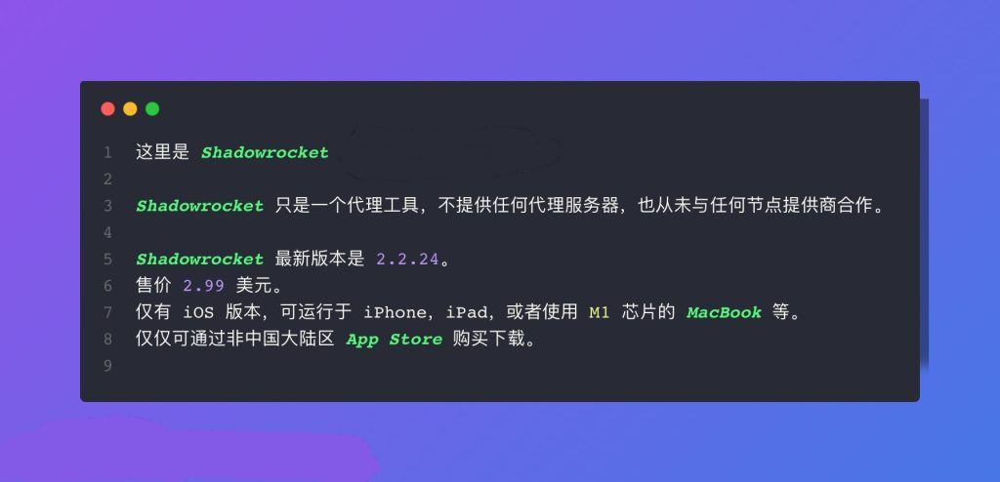

# 官网地址 – shadowrocket

## Shadowrocket 官网地址说明（官方仅限 App Store｜2026 最新）

很多用户在搜索 **Shadowrocket 官网地址**时，往往是想确认：**这个软件是否有官方网站？在哪里可以安全下载？**

需要明确说明的是：

**Shadowrocket并没有独立运营的官方网站**。目前官方唯一的发布与下载渠道，**仅限Apple 官方的 App Store。**

由于地区限制原因，部分国家或地区的App Store中**无法直接搜索到Shadowrocket**，因此用户在访问和下载的过程中，常见会遇到以下问题：

- 在当前App Store区域搜索不到Shadowrocket
- 搜索到的第三方网站，无法确认是否为官方来源
- 担心误下载安装到非官方或存在风险的软件版本

## 正确获取Shadowrocket的官方方式

**目前安全、可靠的官方获取方式只有一种：**

- ✅使用支持Shadowrocket上架的App Store区域苹果账号
- ✅通过Apple官方App Store下载

本页面将围绕“**官方地址**”这一问题，详细说明Shadowrocket的真实发布渠道，并整理当前可行的下载安装方案，帮助您避免误入非官方来源。

**⚠ 官方声明说明：**
Shadowrocket 官方未提供独立官方网站，也未授权任何第三方网站提供修改版、破解版或安装包。请用户务必通过 Apple 官方渠道获取应用，避免账号与设备风险。

Shadowrocket介绍

Shadowrocket是iOS系统即适用于 iPhone/iPad 的基于规则的代理实用程序客户端。功能强大且支持多种代理协议，如SS、SSR、V2Ray、Xray、Trojan等代理协议。

Shadowrocket官网地址

Shadowrocket 官网 Github 项目地址：https://github.com/Shadowrocket

Shadowrocket 美区苹果应用商店官网地址：https://apps.apple.com/us/app/shadowrocket/id932747118

Shadowrocket 港区苹果应用商店官网地址：https://apps.apple.com/hk/app/shadowrocket/id932747118

GitHub 项目地址:

- Shadowrocket 专题：https://github.com/topics/shadowrocket
- Shadowrocket 搜索：https://github.com/search?q=Shadowrocket